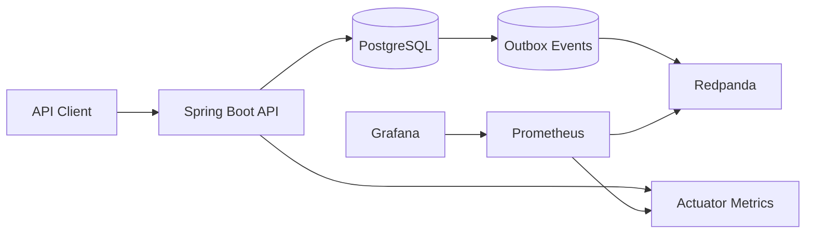

# Architecture Overview

Fintech Reliability Lab is a fictional fintech backend built as a modular monolith. The first implementation milestone establishes the runtime, persistence, messaging, observability, and reliability tables that later domain features will use.

## Phase 1 Boundaries

- The application is one deployable Spring Boot service.
- PostgreSQL is the system of record.
- Redpanda provides Kafka-compatible local streaming.
- Prometheus scrapes application and Redpanda metrics.
- Grafana provisions a starter dashboard from source control.
- Platform tables exist for idempotency, outbox, processed-event dedupe, and audit.

## Deferred To Later Phases

- Accounts, wallets, quotes, transactions, and ledger tables.
- Outbox relay implementation.
- Kafka producers and consumers.
- Transaction processing state machine.
- Failure injection and retry orchestration.
